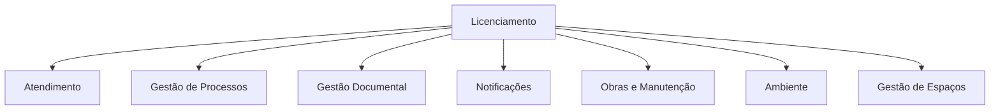
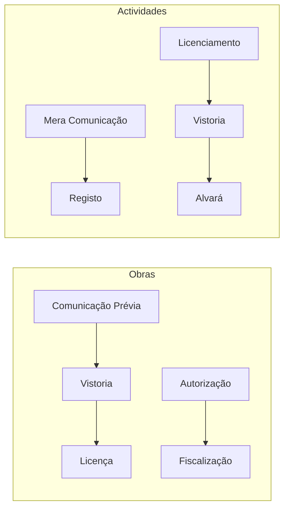

# Domínio: Licenciamento

## Propósito

Modelar as actividades de licenciamento realizadas pela Junta de Freguesia, incluindo licenciamento de obras particulares, actividades económicas, canídeos, ocupação de via pública e outros actos sujeitos a autorização administrativa.

## Responsabilidades

- Gerir o ciclo de vida completo dos processos de licenciamento
- Garantir o cumprimento dos prazos legais e regulamentares
- Assegurar a integração com os serviços inspectivos e fiscalizadores
- Manter o registo histórico de todas as licenças emitidas

## Domínios Relacionados

## Documentos

| Documento | Descrição |
|---|---|
| [Serviços](servicos.md) | Serviços de licenciamento oferecidos pela Junta |
| [Processos](processos.md) | Processos típicos de licenciamento |
| [Fluxos de Trabalho](fluxos-de-trabalho.md) | Workflows específicos do domínio |
| [Tarefas](tarefas.md) | Tarefas operacionais |
| [Documentos](documentos.md) | Documentos necessários e gerados |
| [Pontos de Decisão](pontos-de-decisao.md) | Decisões críticas do domínio |
| [Métricas](metricas.md) | Métricas e KPIs do domínio |
| [Eventos](eventos.md) | Eventos de domínio |
| [Automações](automacoes.md) | Oportunidades de automação |
| [Oportunidades IA](oportunidades-ai.md) | Oportunidades de IA |

## Tipos de Licenciamento

| Tipo | Descrição | Regulamentação |
|---|---|---|
| **Obras Particulares** | Licenciamento de obras em prédios particulares | DL n.º 555/99 (RJUE) |
| **Actividades Económicas** | Licenciamento de comércio, restauração, serviços | DL n.º 10/2015 (SIMPLEX) |
| **Canídeos** | Registo e licenciamento de cães | DL n.º 82/2019 |
| **Ocupação de Via Pública** | Esplanadas, feiras, toldos, obras na via pública | Código de Posturas |
| **Publicidade** | Afixação de publicidade e propaganda | Código de Posturas |
| **Horários Especiais** | Licenciamento de horários de funcionamento | DL n.º 10/2015 |

## Processos Típicos

## Regras de Negócio

- Licenças de obras expiram 1 ano após emissão se não iniciadas
- Renovação de licença de canídeos é anual
- Licenciamento de actividades segue o regime SIMPLEX (silêncio positivo)
- Ocupação de via pública requer parecer dos bombeiros (quando aplicável)

## Métricas Core

- Número de licenças emitidas por mês/tipo
- Tempo médio de licenciamento por tipo
- Taxa de deferimento vs indeferimento
- Licenças expiradas vs renovadas
- Receita de taxas de licenciamento

## Documentos Relacionados

- [02 — Requisitos / Catálogo de Serviços](../../02-requisitos/funcionais/rf001-catalogo-de-servicos.md)
- [04 — Plataforma / Workflow](../../04-servicos-plataforma/plataforma-workflow.md)
- [01 — Ciclo de Vida de Processos](../../01-analise-de-negocio/ciclo-de-vida-processos.md)
