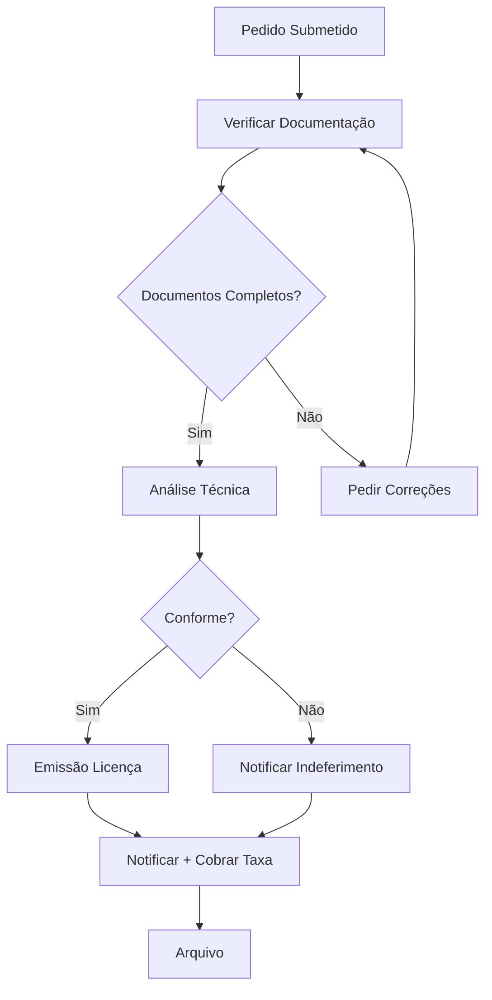

# Licenciamento — Processos

## Processos

| Processo | Descrição | Prazo |
|---|---|---|
| **Licença de Obra Menor** | Obras de conservação, reparação | 20 dias úteis |
| **Licença de Obra Maior** | Obras de construção, ampliação | 60 dias úteis (CM) |
| **Ocupação de Via Pública** | Esplanadas, andaimes, contentores | 15 dias úteis |
| **Actividades Eventuais** | Feiras, eventos, espectáculos | 30 dias úteis |
| **Publicidade** | Afixação de publicidade | 20 dias úteis |
| **Renovação** | Renovação de licença existente | 10 dias úteis |

### Licença de Obra Menor

## Documentos Relacionados

- [Serviços](servicos.md)
- [Fluxos de Trabalho](fluxos-de-trabalho.md)
