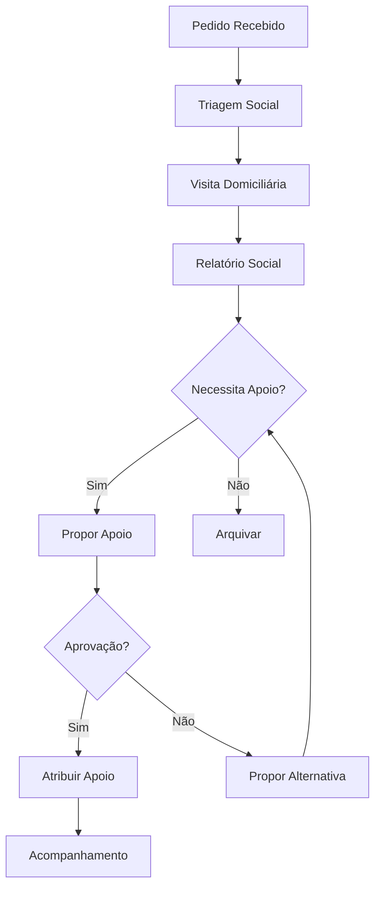

# Ação Social — Fluxos de Trabalho

## Fluxos

| Workflow | Descrição |
|---|---|
| **processo-social** | Abertura e acompanhamento social |
| **atribuicao-apoio** | Atribuição de apoio social |

```mermaid
flowchart TD
    A[Pedido Recebido] --> B[Triagem Social]
    B --> C[Visita Domiciliária]
    C --> D[Relatório Social]
    D --> E{Necessita Apoio?}
    E -->|Sim| F[Propor Apoio]
    E -->|Não| G[Arquivar]
    F --> H{Aprovação?}
    H -->|Sim| I[Atribuir Apoio]
    H -->|Não| J[Propor Alternativa]
    I --> K[Acompanhamento]
    J --> E
```
