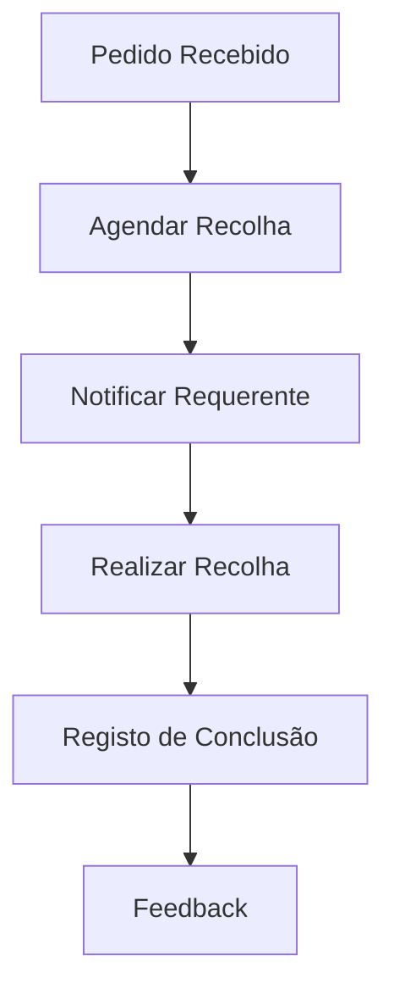

# Ambiente — Fluxos de Trabalho

## Fluxos

| Workflow | Descrição |
|---|---|
| **recolha-volumosos** | Recolha de resíduos volumosos |
| **denuncia-ambiental** | Tratamento de denúncia ambiental |

