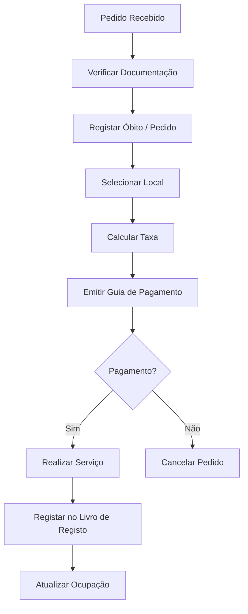

# Cemitérios — Fluxos de Trabalho

## Fluxos

| Workflow | Descrição |
|---|---|
| **inumacao** | Processo de inumação |
| **exumacao** | Processo de exumação |
| **concessao-jazigo** | Atribuição de concessão |

