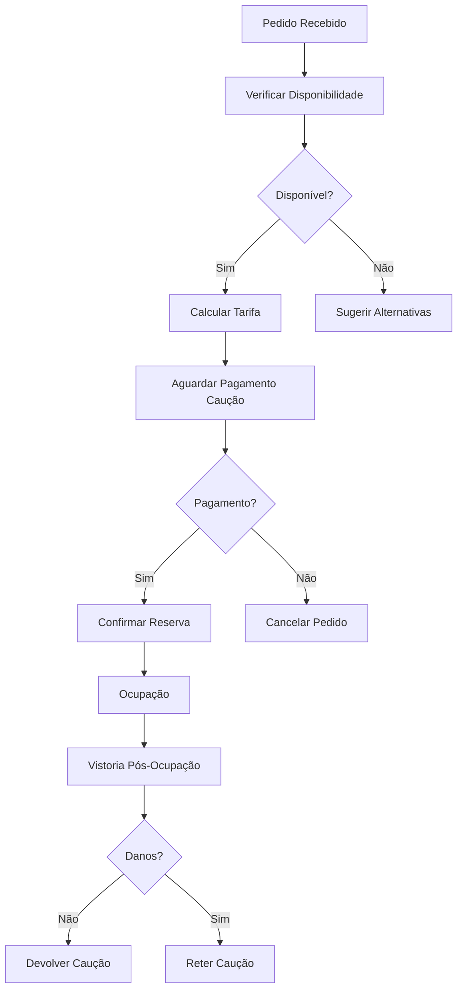

# Espaços — Fluxos de Trabalho

## Fluxos

| Workflow | Descrição |
|---|---|
| **reserva-espaco** | Reserva de espaço municipal |

## Documentos Relacionados

- [04 — Workflow](../../../04-servicos-plataforma/plataforma-workflow.md)
