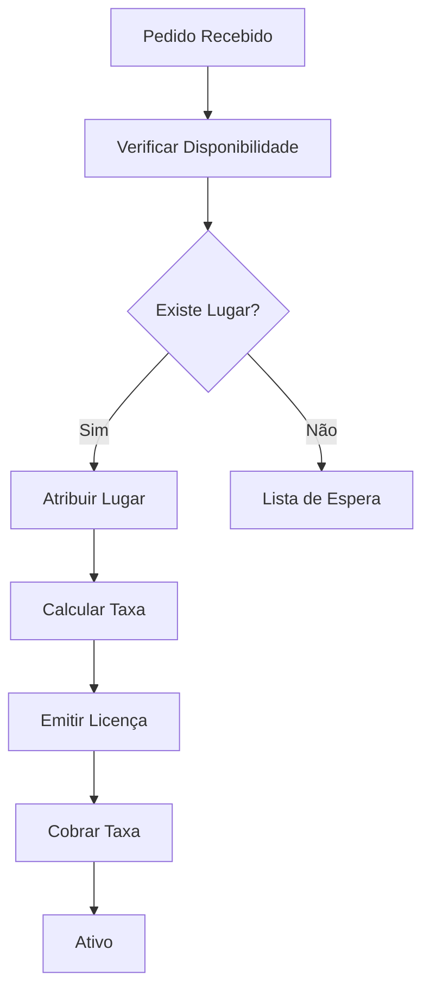

# Feiras e Mercados — Fluxos de Trabalho

## Fluxos

| Workflow | Descrição |
|---|---|
| **atribuicao-lugar** | Atribuição de lugar de feira/mercado |
| **licenca-feirante** | Emissão de licença de feirante |

