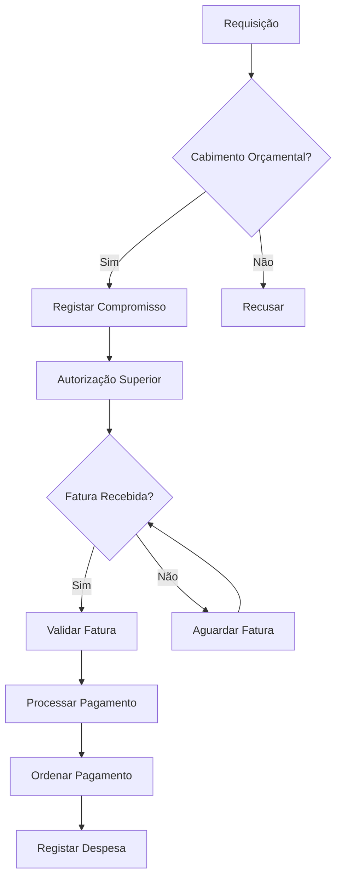

# Financeiro — Fluxos de Trabalho

## Fluxos

| Workflow | Descrição |
|---|---|
| **processamento-despesa** | Processamento de despesa desde requisição ao pagamento |
| **cobranca-taxa** | Cobrança de taxa desde liquidação ao recebimento |
| **execucao-orcamental** | Controlo de execução orçamental |

