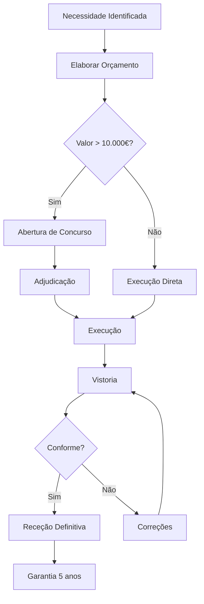

# Obras — Fluxos de Trabalho

## Fluxos

| Workflow | Descrição |
|---|---|
| **empreitada** | Obra adjudicada a terceiros |
| **execucao-direta** | Obra executada por meios próprios |

```mermaid
flowchart TD
    A[Necessidade Identificada] --> B[Elaborar Orçamento]
    B --> C{Valor > 10.000€?}
    C -->|Sim| D[Abertura de Concurso]
    C -->|Não| E[Execução Direta]
    D --> F[Adjudicação]
    F --> G[Execução]
    E --> G
    G --> H[Vistoria]
    H --> I{Conforme?}
    I -->|Sim| J[Receção Definitiva]
    I -->|Não| K[Correções]
    K --> H
    J --> L[Garantia 5 anos]
```
