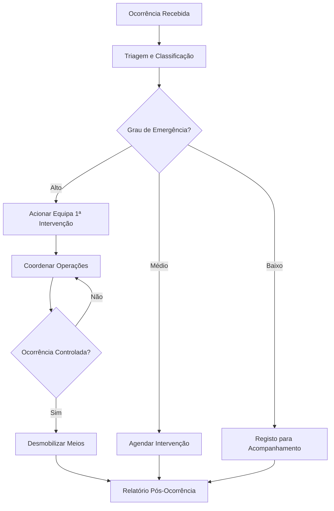

# Proteção Civil — Fluxos de Trabalho

## Fluxos

| Workflow | Descrição |
|---|---|
| **ocorrencia-emergencia** | Gestão de ocorrência de emergência |
| **exercicio-simulacao** | Planeamento e execução de exercício |

