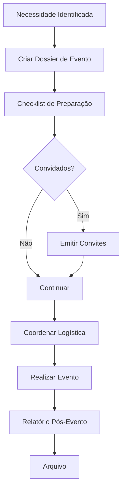

# Protocolo e Comunicação — Fluxos de Trabalho

## Fluxos

| Workflow | Descrição |
|---|---|
| **organizacao-evento** | Planeamento e execução de evento protocolar |
| **emissao-comunicado** | Redação e aprovação de comunicado |

