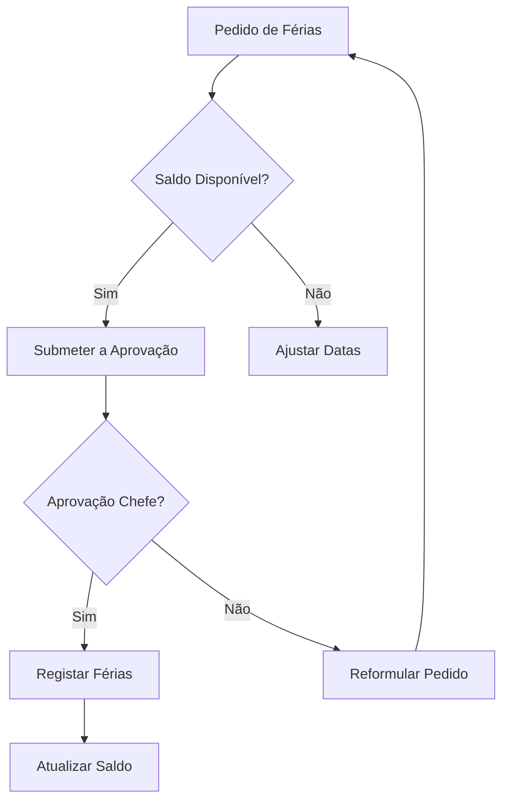

# Recursos Humanos — Fluxos de Trabalho

## Fluxos

| Workflow | Descrição |
|---|---|
| **recrutamento** | Processo de recrutamento e seleção |
| **ferias** | Marcação e aprovação de férias |
| **avaliacao-desempenho** | Processo SIADAP |

