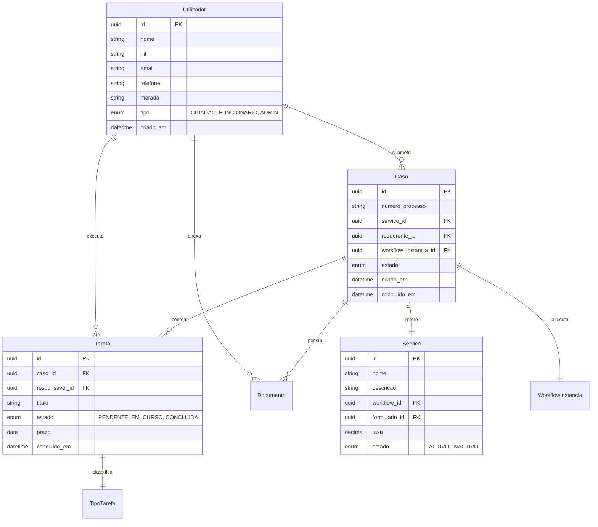
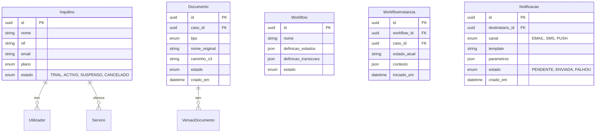

# Diagrama Entidade-Relacionamento

## Propósito

Apresentar o diagrama entidade-relacionamento (DER) conceptual da Junta Observatory Platform, mapeando as principais entidades e seus relacionamentos.

## Entidades Core

## Entidades de Domínio

## Documentos Relacionados

- [06 — Índice](index.md)
- [03 — Modelo de Domínio](../03-arquitetura/modelo-de-dominio.md)
