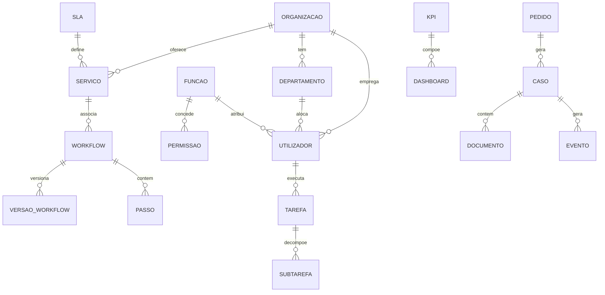

# 06 — Dados

## Propósito

Esta secção documenta o modelo de dados completo da Junta Observatory Platform, incluindo todas as entidades, atributos, relacionamentos, índices, regras de validação, máquinas de estado, políticas de auditoria e exemplos JSON.

## Responsabilidades

- Definir e documentar todas as entidades do sistema
- Estabelecer os relacionamentos e regras de integridade
- Servir como referência para implementação, migrações e consultas
- Garantir a consistência conceptual entre a equipa de desenvolvimento

## Estrutura



## Categorias

| Categoria | Entidades | Descrição |
|---|---|---|
| [Núcleo](nucleo/) | Organização, Utilizador, Função, Permissão, Grupo, Cidadão | Entidades base do sistema |
| [Serviços](servicos/) | Serviço, Workflow, Versão, Passo, Tarefa, Subtarefa, Checklist | Motor de serviços e processos |
| [Documentos](documentos/) | Documento, Modelo, Anexo, Formulário, Campo, Assinatura | Gestão documental |
| [Conhecimento](conhecimento/) | Artigo, Categoria, Etiqueta | Base de conhecimento |
| [Processos](processos/) | Pedido, Caso, Requerente, Parecer | Instâncias de processos |
| [Comunicação](comunicacao/) | Notificação, Modelo, Canal, Template | Notificações e contactos |
| [Observabilidade](observabilidade/) | Evento, RegistoAuditoria, Métrica, KPI, Alerta, Dashboard, Relatório | Monitorização |
| [Qualidade](qualidade/) | SLA, ObjectivoSLA, AcordoNívelServiço | Garantia de qualidade |
| [Automação](automacao/) | Automação, RegraAutomação, ExecuçãoAutomação | Motor de automação |
| [Integração](integracao/) | Integração, Webhook, Conector, LogIntegração | Integrações externas |
| [Administração](administracao/) | Configuração, FeatureFlag, Inquilino, PlanoSubscrição, LimiteRecurso | Gestão da plataforma |
| [Versão](versao/) | Versão, Snapshot | Versionamento |

## Template de Entidade

Cada entidade segue:

```markdown
# Entidade: Nome

## Descrição
## Atributos (tabela)
## Relacionamentos
## Máquina de Estados
## Índices
## Regras de Validação
## Políticas de Auditoria
## Exemplo JSON
```

## Documentos Relacionados

- [Diagrama Entidade-Relação](diagrama-entidade-relacao.md)
- [03 — Arquitectura / Modelo de Domínio](../03-arquitetura/modelo-de-dominio.md)
- [03 — Arquitectura / Event Sourcing](../03-arquitetura/event-sourcing.md)
