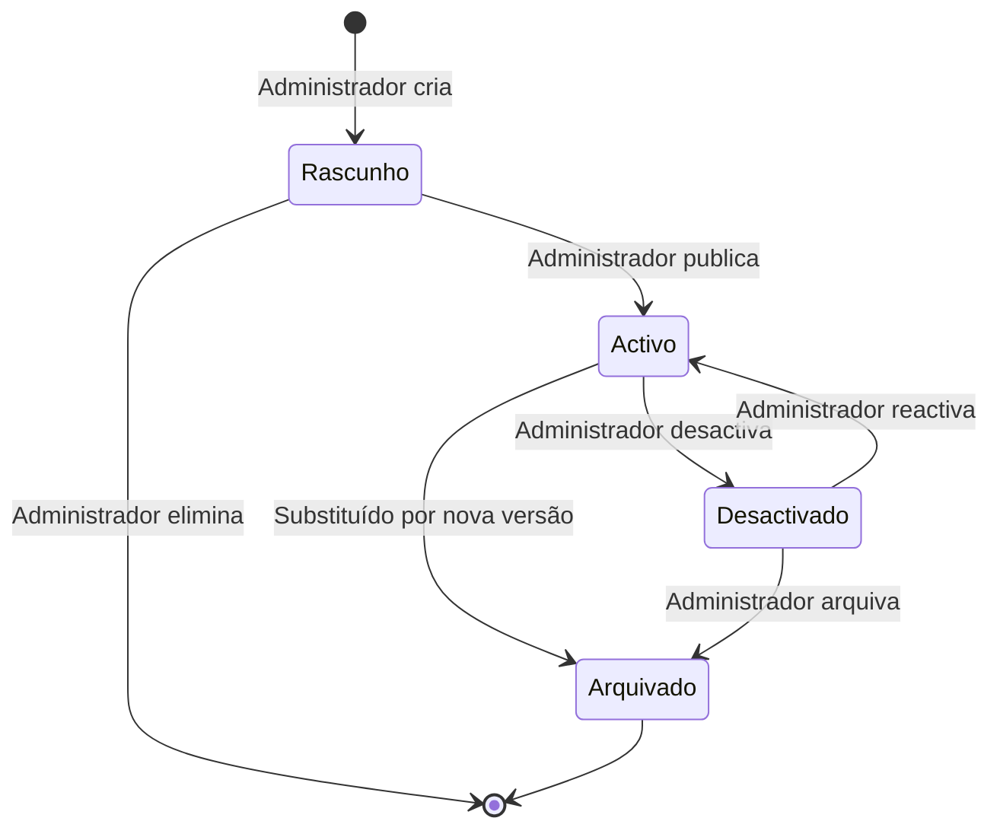

# Entidade: Workflow

## Descrição

Representa um modelo de workflow (processo) configurado na plataforma. Cada workflow é composto por uma sequência de passos, transições, condições e regras de negócio. O workflow é versionado e pode ser associado a múltiplos serviços do catálogo.

## Atributos

| Atributo | Tipo | Obrigatório | Descrição |
|---|---|---|---|
| `id` | UUID | Sim | Identificador único |
| `tenant_id` | UUID | Sim | Identificador do inquilino |
| `nome` | VARCHAR(255) | Sim | Nome do workflow |
| `descricao` | TEXT | Não | Descrição funcional |
| `versao_actual` | INTEGER | Sim | Número da versão activa |
| `categoria` | VARCHAR(100) | Sim | Categoria (licenciamento, atestado, etc.) |
| `departamento_id` | UUID | Sim | Departamento responsável |
| `estado` | ENUM | Sim | Rascunho, Activo, Desactivado, Arquivado |
| `prazo_legal_dias` | INTEGER | Não | Prazo legal em dias úteis |
| `permite_deferimento_tacito` | BOOLEAN | Sim | Se aplica silêncio positivo |
| `config` | JSONB | Não | Configurações adicionais |
| `created_at` | TIMESTAMP | Sim | Data de criação |
| `updated_at` | TIMESTAMP | Sim | Data da última alteração |

## Relacionamentos

| Entidade | Tipo | Descrição |
|---|---|---|
| **Organização** | Pertence | Workflow pertence a um inquilino |
| **Departamento** | Pertence | Workflow é responsabilidade de um departamento |
| **VersãoWorkflow** | Tem muitas | Cada workflow tem N versões |
| **Passo** | Tem muitos | Workflow é composto por N passos |
| **Serviço** | Associado muitos-muitos | Workflow pode estar associado a vários serviços |
| **InstânciaWorkflow** | Tem muitas | Cada workflow gera N instâncias em execução |

## Máquina de Estados



## Índices

| Nome | Colunas | Tipo | Justificação |
|---|---|---|---|
| `idx_workflow_tenant` | `tenant_id` | B-tree | Filtro por inquilino |
| `idx_workflow_tenant_activo` | `tenant_id`, `estado` | B-tree | Listar workflows activos |
| `idx_workflow_departamento` | `departamento_id` | B-tree | Agrupar por departamento |
| `idx_workflow_categoria` | `categoria` | B-tree | Filtro por categoria |
| `idx_workflow_nome_trgm` | `nome` | GIN (trigram) | Pesquisa por nome |

## Regras de Validação

| Campo | Regra |
|---|---|
| `nome` | Obrigatório, único por inquilino, máx 255 caracteres |
| `passos` | Workflow deve ter pelo menos 1 passo para ser activado |
| `estado` | Só workflows em estado "Activo" podem ser usados em novos processos |
| `prazo_legal_dias` | Deve ser ≥ 1 se preenchido |
| `departamento_id` | Deve referir um departamento válido do inquilino |

## Políticas de Auditoria

- Cada alteração ao workflow regista nova versão
- A criação, activação, desactivação e arquivo do workflow são registados no event store
- A alteração de passos existentes é bloqueada em workflows com instâncias activas (nova versão obrigatória)

## Exemplo JSON

```json
{
  "id": "a1b2c3d4-e5f6-7890-abcd-ef1234567890",
  "tenant_id": "f1e2d3c4-b5a6-7890-abcd-ef1234567890",
  "nome": "Licenciamento de Obras Particulares",
  "descricao": "Processo de licenciamento de obras particulares na freguesia",
  "versao_actual": 3,
  "categoria": "licenciamento",
  "departamento_id": "a2b3c4d5-e6f7-8901-abcd-ef1234567890",
  "estado": "activo",
  "prazo_legal_dias": 60,
  "permite_deferimento_tacito": true,
  "config": {
    "permite_sub_processos": false,
    "nivel_urgencia_padrao": "normal",
    "notificar_cidadao_em_cada_passo": true
  },
  "created_at": "2026-01-15T10:00:00Z",
  "updated_at": "2026-06-20T14:30:00Z"
}
```

## Documentos Relacionados

- [Entidade: VersãoWorkflow](entidade-versao-workflow.md)
- [Entidade: Passo](entidade-passo.md)
- [Entidade: Serviço](entidade-servico.md)
- [04 — Plataforma / Workflow](../../04-servicos-plataforma/plataforma-workflow.md)
- [03 — Arquitectura / Diagramas de Estado](../../03-arquitetura/diagramas-de-estado.md)
