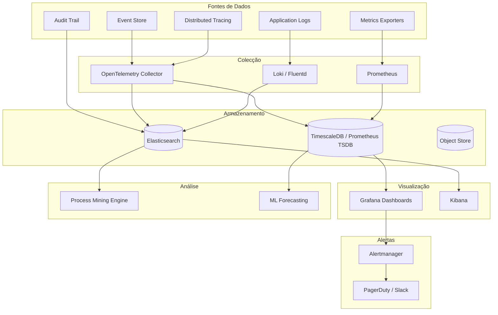

# 08 — Observabilidade

## Propósito

Esta secção descreve o modelo de observabilidade da Junta Observatory Platform, incluindo eventos, logs, métricas, tracing distribuído, dashboards, alertas, process mining e análise preditiva. A plataforma é "observable by design" — tudo o que acontece é registado, mensurável e analisável.

## Responsabilidades

- Definir o modelo de eventos e a trilha de auditoria
- Estabelecer as métricas técnicas, de negócio e de processo
- Especificar dashboards, alertas e relatórios operacionais
- Documentar as capacidades de process mining e detecção de gargalos
- Definir SLIs, SLOs e estratégia de alerta

## Documentos

| Documento | Descrição |
|---|---|
| [Modelo de Eventos](modelo-de-eventos.md) | Schema, categorias e fluxo de eventos |
| [Trilha de Auditoria](trilha-de-auditoria.md) | Registo imutável de acções |
| [Gestão de Logs](gestao-de-logs.md) | Logs estruturados e centralizados |
| [Métricas — Visão Geral](metricas-visao-geral.md) | Classificação e estratégia de métricas |
| [Métricas Técnicas](metricas-tecnicas.md) | Latência, throughput, erros, recursos |
| [Métricas de Negócio](metricas-de-negocio.md) | Volume de processos, satisfação, conformidade |
| [Métricas de Processo](metricas-de-processo.md) | TAT, bottlenecks, eficiência |
| [Dashboards](dashboards-observacao.md) | Painéis de monitorização |
| [Alertas](alertas.md) | Regras e canais de alerta |
| [Relatórios Operacionais](relatorios-operacionais.md) | Relatórios periódicos |
| [Análise Histórica](analise-historica.md) | Tendências e sazonalidade |
| [Process Mining](process-mining.md) | Descoberta e análise de processos |
| [Detecção de Gargalos](detecao-de-gargalos.md) | Identificação de estrangulamentos |
| [Previsão](previsao.md) | Forecast de volume e capacidade |
| [Planeamento de Capacidade](planeamento-capacidade.md) | Estratégia de scaling |
| [Tracing Distribuído](tracing-distribuido.md) | OpenTelemetry e tracing |
| [Health Checks](health-checks.md) | Endpoints de saúde |
| [SLIs e SLOs](slos-slis.md) | Definição de service levels |

## Pilha de Observabilidade

## Principais SLOs

| Indicador | SLO | Medição |
|---|---|---|
| Disponibilidade da plataforma | 99.9% | Uptime mensal |
| Latência API (p95) | ≤ 500ms | Prometheus |
| Throughput de eventos | 10.000 eventos/s | Kafka métricas |
| Precisão de alertas | ≥ 95% | True positive rate |
| Tempo de detecção de incidente | ≤ 5 minutos | Alerta → notificação |

## Documentos Relacionados

- [03 — Arquitectura / Event Sourcing](../03-arquitetura/event-sourcing.md)
- [04 — Plataforma / Auditoria](../04-servicos-plataforma/plataforma-auditoria.md)
- [04 — Plataforma / Eventos](../04-servicos-plataforma/plataforma-eventos.md)
- [09 — Inteligência Artificial / Analítica Preditiva](../09-inteligencia-artificial/analise-preditiva.md)
- [11 — Operações / Monitorização](../11-operacoes/monitorizacao-infra.md)
