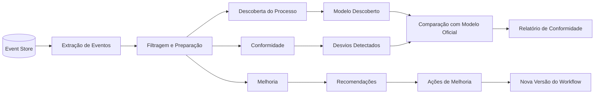

# Process Mining

## Propósito

Descrever a capacidade de Process Mining da Junta Observatory Platform, que permite descobrir, analisar e melhorar processos reais com base nos eventos registados durante a execução dos workflows.

## Responsabilidades

- Extrair conhecimento dos logs de eventos para melhorar processos
- Identificar desvios entre o processo modelado e o executado
- Detectar gargalos, ineficiências e oportunidades de melhoria
- Fornecer recomendações baseadas em dados para optimização de workflows

## Descrição Detalhada

### Fluxo de Process Mining

### Funcionalidades

| Funcionalidade | Descrição |
|---|---|
| **Descoberta de Processo** | Geração automática do modelo real a partir dos eventos |
| **Conformidade** | Comparação entre o modelo oficial e o executado |
| **Detecção de Gargalos** | Identificação de passos com maior tempo de espera |
| **Análise de Variantes** | Identificação de caminhos alternativos frequentes |
| **Análise de Performance** | Métricas de tempo por passo, transição e recurso |
| **Social Network Mining** | Análise das interacções entre actores do processo |
| **Predição** | Previsão de duração e probabilidade de conclusão no prazo |

### Dashboards de Process Mining

| Dashboard | Descrição |
|---|---|
| **Visão Geral do Processo** | Mapa do processo com frequências e tempos |
| **Gargalos** | Passos com maior tempo de espera |
| **Conformidade** | Percentagem de instâncias conformes ao modelo |
| **Variantes** | Caminhos alternativos e suas frequências |
| **Performance Temporal** | Tempo médio, mediano e percentis por passo |
| **Actores** | Carga de trabalho por funcionário/departamento |

### Métricas de Process Mining

| Métrica | Descrição |
|---|---|
| **Conformidade (%)** | Instâncias que seguiram o modelo oficial |
| **Desvio Médio** | Diferença entre tempo real e esperado por passo |
| **Gargalo (horas/dias)** | Tempo de espera médio no passo identificado |
| **Taxa de Re-Trabalho** | Percentagem de instâncias que voltaram a passos anteriores |
| **Variantes Únicas** | Número de caminhos distintos executados |
| **Frequência do Caminho Principal** | Percentagem de instâncias no caminho mais comum |

### Relatórios

| Relatório | Periodicidade | Destinatário |
|---|---|---|
| Análise Mensal de Processos | Mensal | Chefes de Departamento |
| Relatório de Gargalos | Semanal | Presidente / Vogais |
| Relatório de Conformidade | Trimestral | Auditoria |
| Benchmark entre Workflows | Trimestral | Administrador |

## Requisitos

- O process mining deve processar eventos em tempo real (streaming) e batch (histórico)
- Os resultados devem ser visualizáveis em dashboards interativos
- O sistema deve permitir exportar modelos descobertos em formato BPMN
- A análise de conformidade deve identificar desvios com precisão

## Regras de Negócio

- Apenas eventos de processos concluídos (ou com volume suficiente) são considerados para descoberta
- Dados pessoais são anonimizados antes da análise de process mining
- Modelos descobertos são sugestões; a alteração do workflow oficial requer aprovação
- O relatório de conformidade é parte integrante da auditoria interna

## Critérios de Aceitação

- O process mining descobre correctamente o modelo real de um workflow com 1000+ instâncias
- Gargalos são identificados com precisão ≥ 90% (comparado com análise manual)
- Desvios de conformidade são detectados e reportados
- O dashboard de process mining é interactivo e permite drill-down por instância

## Melhorias Futuras

- Prescriptive mining (recomendação automática do próximo passo óptimo)
- Integração com reinforcement learning para optimização contínua
- Simulação de cenários "what-if" para testar alterações antes de implementar
- Detecção de fraudes em processos

## Documentos Relacionados

- [Modelo de Eventos](modelo-de-eventos.md)
- [Detecção de Gargalos](detecao-de-gargalos.md)
- [06 — Dados / Evento](../06-dados/observabilidade/entidade-evento.md)
- [09 — Inteligência Artificial / Analítica Preditiva](../09-inteligencia-artificial/analise-preditiva.md)
- [01 — Ciclo de Vida de Processos](../01-analise-de-negocio/ciclo-de-vida-processos.md)
