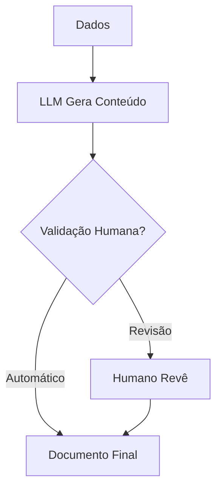

# Geração de Documentos

## Propósito
Definir a geração automática de documentos usando IA.

## Documentos Gerados

| Documento | Fonte |
|---|---|
| **Minuta de Despacho** | Dados do processo + similaridade |
| **Notificação** | Template + dados do processo |
| **Parecer** | Análise de documentos + legislação |
| **Relatório** | Dados agregados + templates |

## Fluxo

