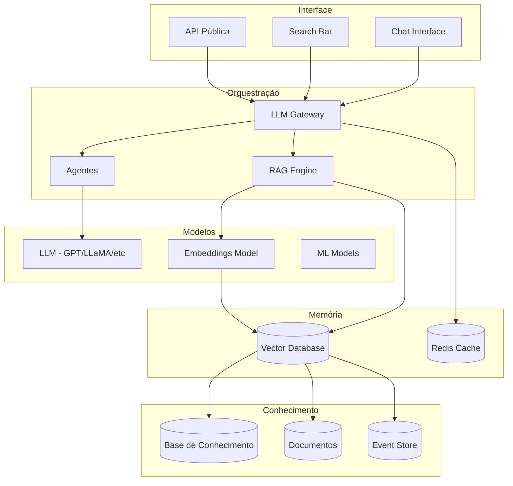

# 09 — Inteligência Artificial

## Propósito

Esta secção documenta todas as capacidades de inteligência artificial da Junta Observatory Platform, incluindo o assistente virtual, recuperação de conhecimento, geração de documentos, recomendações, análise preditiva, sugestões de workflow e pesquisa semântica.

## Responsabilidades

- Definir a arquitectura e os modelos de IA da plataforma
- Estabelecer as políticas de privacidade e ética para utilização de IA
- Documentar cada capacidade de IA com requisitos, métricas e critérios de aceitação
- Servir como referência para a equipa de dados e ML

## Documentos

| Documento | Descrição |
|---|---|
| [Visão Geral](visao-geral.md) | Estratégia de IA na plataforma |
| [Assistente Virtual](assistente-virtual.md) | Chat interface para funcionários e cidadãos |
| [Recuperação de Conhecimento](recuperacao-conhecimento.md) | RAG sobre base de conhecimento e documentos |
| [Geração de Documentos](geracao-documentos.md) | Preenchimento automático de documentos |
| [Sumarização](sumarizacao.md) | Sumarização de processos, documentos e eventos |
| [Motor de Recomendação](motor-recomendacao.md) | Recomendações personalizadas |
| [Análise Preditiva](analise-preditiva.md) | Previsão de duração, carga e riscos |
| [Sugestões de Workflow](sugestoes-workflow.md) | Sugestão do próximo passo óptimo |
| [Sugestões de Automação](sugestoes-automacao.md) | Identificação de passos automatizáveis |
| [Interface Conversacional](interface-conversacional.md) | Chat para cidadãos e funcionários |
| [Pesquisa Semântica](pesquisa-semantica.md) | Search baseado em embeddings |
| [Estratégia LLM](estrategia-llm.md) | Modelos, hosting, fine-tuning |
| [Privacidade de Dados](privacidade-dados-ai.md) | Privacidade e RGPD na IA |
| [Métricas de IA](metricas-ai.md) | Precisão, recall, latência |
| [Ética de IA](etica-ai.md) | Princípios éticos e vieses |

## Arquitectura de IA

## Princípios de IA

1. **Human-in-the-loop** — IA sugere, humano decide (acções críticas)
2. **Privacidade first** — Dados não saem do inquilino sem anonimização
3. **Transparência** — Respostas incluem fontes e confiança
4. **Auditabilidade** — Todas as interacções são registadas
5. **Melhoria contínua** — Modelos são avaliados e actualizados regularmente

## Modelos e Infraestrutura

| Componente | Tecnologia |
|---|---|
| LLM | GPT-4o / LLaMA 3 (self-hosted para dados sensíveis) |
| Embeddings | text-embedding-3-large / BGE |
| Vector Database | Qdrant / Pinecone |
| RAG Framework | LangChain / LlamaIndex |
| ML Serving | MLflow + BentoML |
| GPU Inference | NVIDIA Triton / vLLM |

## Documentos Relacionados

- [02 — Requisitos / Assistente IA](../02-requisitos/funcionais/rf019-assistente-ai.md)
- [04 — Plataforma / Assistente IA](../04-servicos-plataforma/plataforma-assistente-ai.md)
- [08 — Observabilidade](../08-observabilidade/index.md)
- [13 — Governança / Privacidade](../13-governanca-conformidade/privacidade.md)
- [13 — Governança / Ética IA](../13-governanca-conformidade/etica-ai.md)
