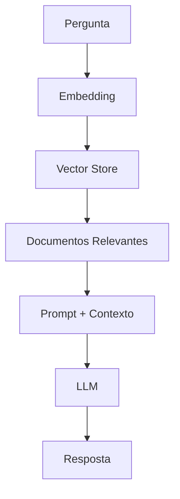

# Recuperação de Conhecimento (RAG)

## Propósito
Definir o sistema de Retrieval-Augmented Generation para respostas contextuais.

## Fluxo

## Fontes de Conhecimento

| Fonte | Chunking | Indexação |
|---|---|---|
| Base de Conhecimento | 512 tokens | Diária |
| Legislação | 1024 tokens | Semanal |
| FAQs | Por pergunta | Diária |
| Processos Anónimos | 512 tokens | Mensal |

## Documentos Relacionados

- [Estratégia LLM](estrategia-llm.md)
- [Pesquisa Semântica](pesquisa-semantica.md)
