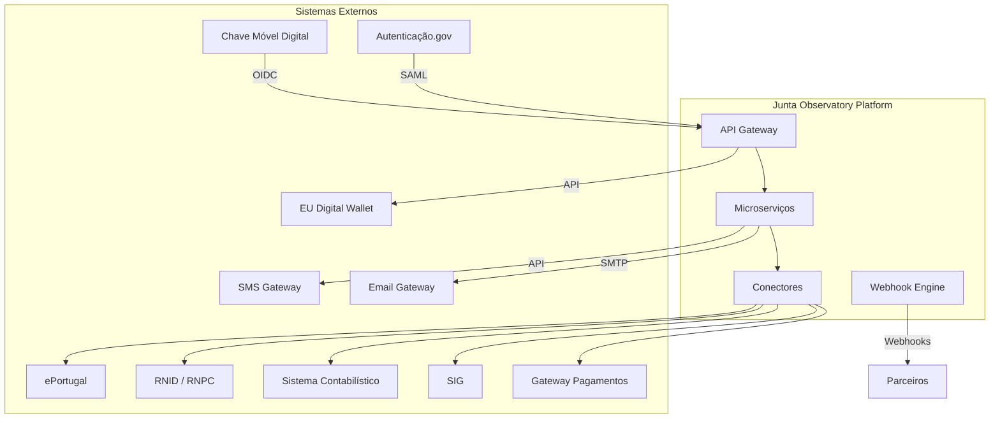

# 10 — Integrações

## Propósito

Esta secção documenta todas as integrações da Junta Observatory Platform com sistemas externos, incluindo a arquitetura da API, conectores, autenticação externa e integrações com o ecossistema nacional de administração pública.

## Responsabilidades

- Definir a arquitectura de integrações da plataforma
- Documentar cada conector e integração externa
- Estabelecer os padrões de segurança e autenticação para integrações
- Servir como referência para integradores e parceiros

## Documentos

| Documento | Descrição |
|---|---|
| [Arquitectura API](arquitetura-api.md) | Desenho da API pública e interna |
| [API Pública](api-publica.md) | Endpoints da API REST externa |
| [API Interna](api-interna.md) | API de comunicação entre microserviços |
| [Webhooks](webhooks.md) | Sistema de webhooks para eventos |
| [Conectores](conectores.md) | Framework de conectores |
| [Autenticação Externa](autenticacao-externa.md) | OAuth 2.0, OpenID Connect |
| [Chave Móvel Digital](chave-movel-digital.md) | Integração com CMD |
| [Autenticação.gov](autenticacao-gov.md) | Integração com plataforma de autenticação |
| [Pagamentos](pagamentos.md) | Gateways de pagamento |
| [Sistemas Nacionais](sistemas-nacionais.md) | RNID, RNPC, Conservatórias |
| [Sistema Contabilístico](sistema-contabilistico.md) | Integração ERP |
| [SIG](sig.md) | Sistemas de Informação Geográfica |
| [Email](email.md) | Gateway de email |
| [SMS](sms.md) | Gateway de SMS |
| [Carteira Digital eIDAS](carteira-digital-eidas.md) | European Digital Identity Wallet |

## Arquitectura de Integração

## Documentos Relacionados

- [02 — RF-020 API Pública](../02-requisitos/funcionais/rf020-api-publica.md)
- [03 — Arquitectura / API Gateway](../03-arquitetura/api-gateway.md)
- [03 — Arquitectura / Autenticação](../03-arquitetura/autenticacao.md)
- [03 — Arquitectura / Segurança](../03-arquitetura/seguranca.md)
