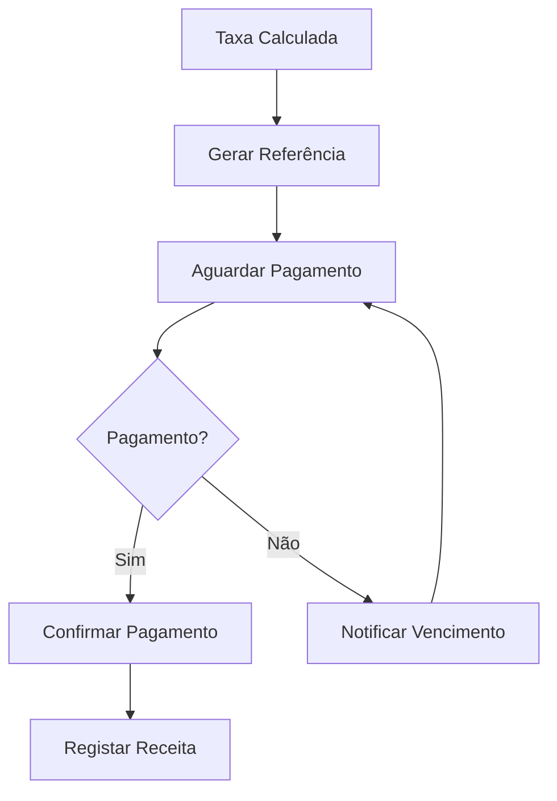

# Pagamentos

## Propósito
Integração com sistemas de pagamento para cobrança de taxas.

## Métodos

| Método | Descrição |
|---|---|
| **Referências Multibanco** | Geração de referências SIBS |
| **MB Way** | Pagamento por telemóvel |
| **Cartão** | Pagamento por cartão (Stripe) |
| **Transferência** | Transferência bancária |
| **Presencial** | Pagamento no balcão (multibanco/ numerário) |

## Fluxo

## Documentos Relacionados

- [05 — Financeiro](../05-dominios-negocio/plugins/dominio-financeiro/index.md)
