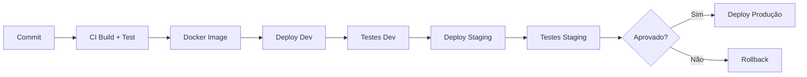

# Pipeline CD

## Propósito
Definir o pipeline de Continuous Deployment.

## Fluxo

## Gate

| Gate | Verificação |
|---|---|
| **CI** | Testes unitários, SAST, SCA |
| **Dev** | Testes de integração |
| **Staging** | Testes E2E, DAST, smoke tests |
| **Produção** | Aprovação manual + canary |
