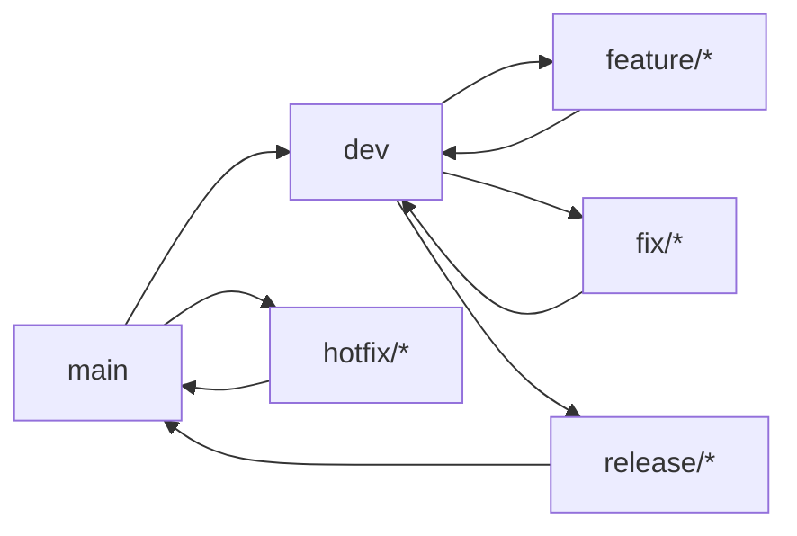

# Estratégia de Ramificação

## Propósito
Definir a estratégia de branches para versionamento.

## Modelo

## Convenções

| Branch | Base | Destino | Descrição |
|---|---|---|---|
| `main` | — | — | Produção |
| `dev` | main | main | Integração |
| `feature/xxx` | dev | dev | Nova funcionalidade |
| `fix/xxx` | dev | dev | Correção |
| `hotfix/xxx` | main | main + dev | Correção urgente |
| `release/x.y` | dev | main | Preparação de release |
