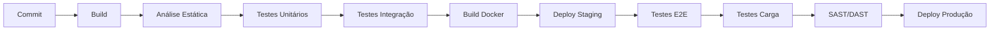

# 12 — Desenvolvimento

## Propósito

Esta secção documenta as normas, práticas e ferramentas de desenvolvimento da Junta Observatory Platform, incluindo coding standards, estratégia de ramificação, CI/CD, testes e versionamento.

## Responsabilidades

- Estabelecer as normas de desenvolvimento para toda a equipa
- Definir a estratégia de CI/CD e branching
- Documentar a estratégia de testes e qualidade de código
- Servir como guia de onboarding para novos developers

## Documentos

| Documento | Descrição |
|---|---|
| [Normas de Código](normas-codigo.md) | Coding standards e linters |
| [Estratégia de Ramificação](estrategia-ramificacao.md) | Git branching model |
| [Pipeline CI](pipeline-ci.md) | Continuous Integration |
| [Estratégia de Testes](estrategia-testes.md) | Abordagem global de testes |
| [Testes Unidade](testes-unidade.md) | Testes unitários |
| [Testes Integração](testes-integracao.md) | Testes de integração e contrato |
| [Testes E2E](testes-e2e.md) | Testes end-to-end |
| [Testes Carga](testes-carga.md) | Testes de desempenho |
| [Testes Segurança](testes-seguranca.md) | SAST, DAST, SCA |
| [Documentação Técnica](documentacao-tecnica.md) | Como documentar o código |
| [Convenções](convencoes.md) | Convenções de nomenclatura e organização |
| [Gestão de Dependências](gestao-dependencias.md) | Gestão de bibliotecas e actualizações |
| [Versionamento Semântico](versionamento-semantico.md) | SemVer 2.0 para APIs e bibliotecas |

## Pipeline CI/CD

## Stack de Desenvolvimento

| Categoria | Ferramenta |
|---|---|
| IDE | IntelliJ IDEA / VS Code |
| Linguagem | Java 21+, Kotlin, TypeScript |
| Build | Maven / Gradle (backend), Vite (frontend) |
| QA | SonarQube, Checkstyle, ESLint |
| CI/CD | GitLab CI / GitHub Actions |
| Repositório | Git + GitFlow |
| Artefactos | Docker Registry, Nexus |
| Testes | JUnit 5, Playwright, k6 |
| Segurança | Trivy, OWASP ZAP, Snyk |

## Documentos Relacionados

- [03 — Arquitectura](../03-arquitetura/index.md)
- [11 — Operações](../11-operacoes/index.md)
- [14 — Qualidade](../14-qualidade/index.md)
