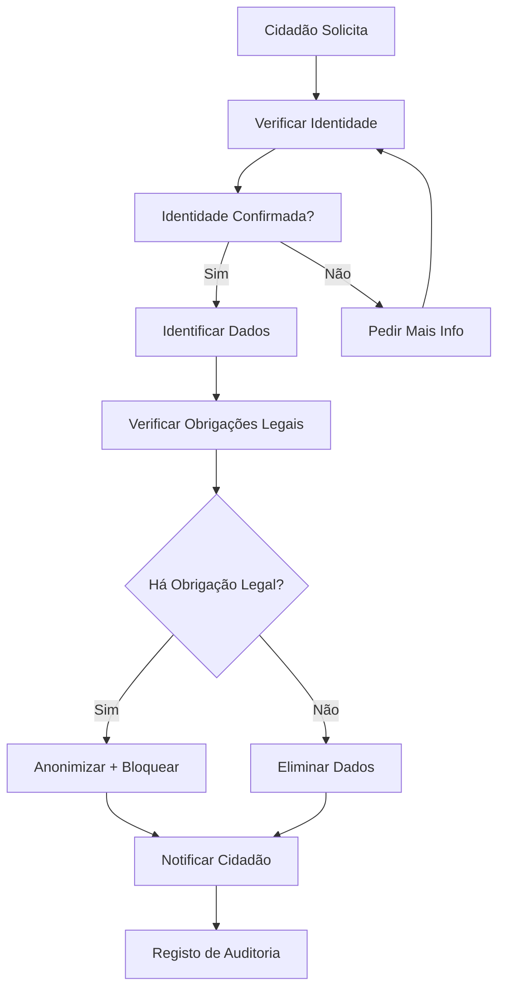

# Direito ao Apagamento

## Propósito
Definir o processo para exercício do direito ao apagamento (RGPD Art. 17).

## Fluxo

## Prazos

| Etapa | Prazo |
|---|---|
| Confirmação de receção | 5 dias úteis |
| Resposta ao titular | 30 dias (prorrogável +30) |
| Execução do apagamento | 30 dias após decisão |
| Notificação a terceiros | 15 dias após execução |
