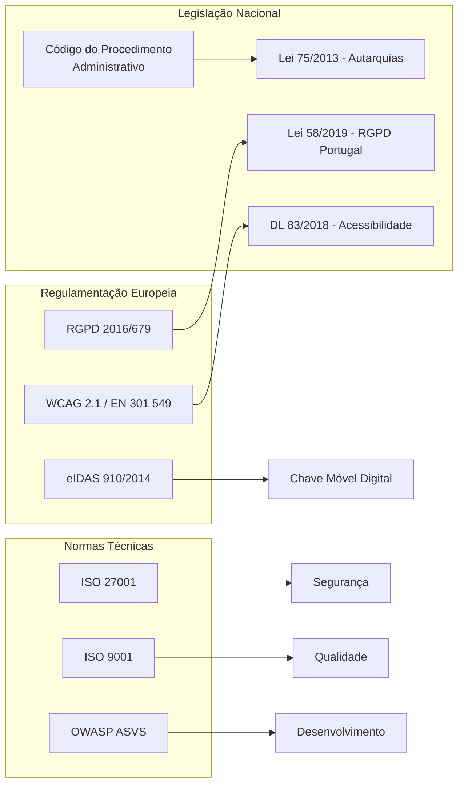

# 13 — Governança e Conformidade

## Propósito

Esta secção documenta as políticas de governança, segurança, privacidade e conformidade regulatória da Junta Observatory Platform, garantindo que a plataforma cumpre integralmente a legislação aplicável e as melhores práticas de administração pública digital.

## Responsabilidades

- Garantir conformidade com RGPD, eIDAS e Lei Administrativa portuguesa
- Estabelecer políticas de segurança e privacidade de dados
- Documentar os procedimentos de auditoria e conformidade
- Assegurar acessibilidade digital e localização

## Documentos

| Documento | Descrição |
|---|---|
| [RGPD](rgpd.md) | Conformidade com Regulamento Geral de Protecção de Dados |
| [Segurança de Dados](seguranca-dados.md) | Políticas de segurança da informação |
| [Privacidade](privacidade.md) | Política de privacidade e consentimento |
| [Retenção de Dados](retencao-dados.md) | Prazos de conservação e eliminação |
| [Direito ao Apagamento](direito-apagamento.md) | Processo de direito ao esquecimento |
| [Lei Administrativa](lei-administrativa.md) | Conformidade com CPA e legislação autárquica |
| [Arquivo Digital](arquivo-digital.md) | Políticas de arquivo e conservação digital |
| [Acessibilidade Digital](acessibilidade-digital.md) | Conformidade WCAG 2.1 AA |
| [Localização](localizacao.md) | Adaptação a diferentes regiões/línguas |
| [Internacionalização](internacionalizacao.md) | Suporte multi-idioma |
| [Ética IA](etica-ai.md) | Princípios éticos para utilização de IA |
| [Auditoria de Conformidade](auditoria-conformidade.md) | Processo de auditoria interna e externa |

## Quadro Regulatório

## Responsabilidades

| Função | Responsabilidade |
|---|---|
| **Data Protection Officer (DPO)** | Monitorizar conformidade RGPD, gerir ROPA |
| **Responsável de Segurança** | Implementar políticas de segurança |
| **Jurista** | Validar conformidade legal dos processos |
| **Auditor Interno** | Realizar auditorias de conformidade |
| **Administrador** | Garantir configuração conforme por inquilino |

## Documentos Relacionados

- [01 — Regras de Negócio Globais](../01-analise-de-negocio/regras-de-negocio-globais.md)
- [02 — Requisitos Não Funcionais / Conformidade](../02-requisitos/nao-funcionais/rnf007-conformidade.md)
- [03 — Arquitectura / Segurança](../03-arquitetura/seguranca.md)
- [14 — Qualidade](../14-qualidade/index.md)
