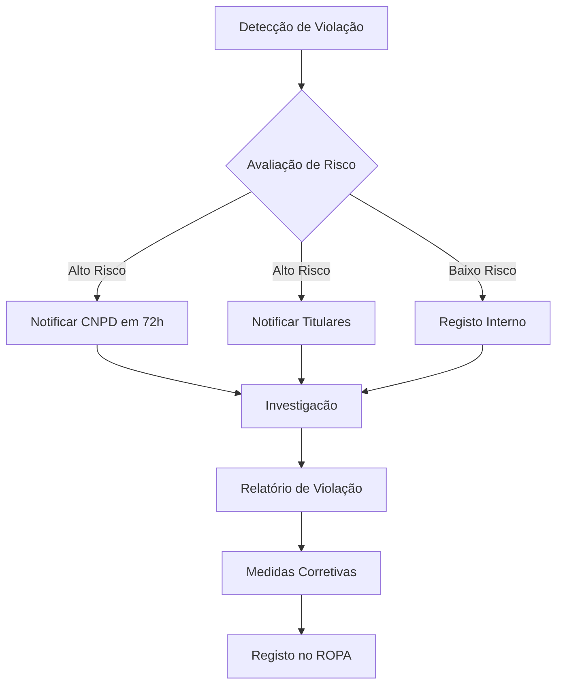

# RGPD — Regulamento Geral de Protecção de Dados

## Propósito

Garantir que a Junta Observatory Platform cumpre integralmente o Regulamento (UE) 2016/679 (RGPD) e a Lei n.º 58/2019 (lei de execução nacional), assegurando a protecção dos dados pessoais dos cidadãos e funcionários.

## Responsabilidades

- Implementar os princípios de protecção de dados desde a concepção (Privacy by Design)
- Garantir os direitos dos titulares dos dados
- Manter o registo de actividades de tratamento (ROPA)
- Assegurar a notificação de violações de dados

## Requisitos RGPD

| Artigo | Requisito | Implementação |
|---|---|---|
| Art. 5.º | Licitude, lealdade e transparência | Consentimento explícito para cada finalidade |
| Art. 5.º | Limitação das finalidades | Dados recolhidos apenas para o serviço solicitado |
| Art. 5.º | Minimização dos dados | Apenas dados estritamente necessários |
| Art. 5.º | Exatidão | Mecanismos de correcção pelo titular |
| Art. 5.º | Limitação da conservação | Políticas de retenção automáticas |
| Art. 5.º | Integridade e confidencialidade | Encriptação, controlo de acesso |
| Art. 7.º | Condições para consentimento | Consentimento explícito, destacado, revogável |
| Art. 12.º | Transparência das informações | Política de privacidade acessível |
| Art. 15.º | Direito de acesso | Portal do cidadão com consulta de dados |
| Art. 16.º | Direito de rectificação | Formulário de correcção de dados |
| Art. 17.º | Direito ao apagamento | Processo de "right to be forgotten" |
| Art. 20.º | Portabilidade | Exportação de dados em formato JSON/CSV |
| Art. 25.º | Protecção de dados por defeito | Permissões mínimas por omissão |
| Art. 30.º | Registo de actividades de tratamento | ROPA automático |
| Art. 32.º | Segurança do tratamento | Encriptação, pseudonimização, backup |
| Art. 33.º | Notificação de violações | Alerta automático + workflow de notificação |
| Art. 35.º | Avaliação de impacto (PIA) | PIA para cada novo domínio |

## Registo de Actividades de Tratamento (ROPA)

O ROPA é gerado automaticamente pela plataforma e inclui:

| Campo | Descrição |
|---|---|
| Nome do tratamento | Ex: "Licenciamento de Obras" |
| Finalidade | Ex: "Instrução e decisão de pedidos de licenciamento" |
| Base legal | Ex: "Consentimento do titular (Art. 7.º)" |
| Categorias de titulares | Cidadãos, requerentes, representantes |
| Categorias de dados | Nome, NIF, morada, contactos |
| Destinatários | Departamentos, entidades externas (quando aplicável) |
| Prazo de conservação | Definição por tipo de processo |
| Medidas de segurança | Encriptação, controlo de acesso, pseudonimização |
| Transferências internacionais | N/A (dados residentes em Portugal/UE) |

## Direitos dos Titulares

| Direito | Prazo Legal | Interface |
|---|---|---|
| Acesso | 30 dias | Portal do cidadão + API |
| Rectificação | 15 dias | Formulário online |
| Apagamento | 30 dias | Workflow dedicado |
| Limitação | 15 dias | Formulário online |
| Portabilidade | 30 dias | Exportação automática |
| Oposição | 15 dias | Formulário online |

## Violações de Dados

## Critérios de Aceitação

- ROPA é gerado automaticamente e exportável para auditoria
- O cidadão consegue exercer todos os direitos via portal
- Violações de dados são detectadas e notificadas dentro do prazo legal
- O consentimento é registado com timestamp e finalidade
- A política de retenção é aplicada automaticamente

## Documentos Relacionados

- [Privacidade](privacidade.md)
- [Retenção de Dados](retencao-dados.md)
- [Direito ao Apagamento](direito-apagamento.md)
- [Segurança de Dados](seguranca-dados.md)
- [Auditoria de Conformidade](auditoria-conformidade.md)
- [02 — RNF-007 Conformidade](../02-requisitos/nao-funcionais/rnf007-conformidade.md)
