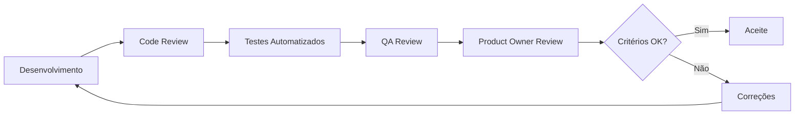

# Critérios de Aceitação Globais

## Propósito

 Definir os critérios de aceitação que se aplicam transversalmente a todos os requisitos e entregáveis da Junta Observatory Platform, garantindo consistência e qualidade mínima.

## Responsabilidades

- Estabelecer os critérios mínimos de qualidade para qualquer funcionalidade
- Garantir que cada entregável é verificável antes de ser aceite
- Servir como checklist para a equipa de QA e Product Owner

## Critérios por Categoria

### Funcionalidade

| Critério | Descrição |
|---|---|
| CA-F-01 | A funcionalidade implementa todos os requisitos especificados no RF |
| CA-F-02 | Os fluxos alternativos e de excepção estão implementados |
| CA-F-03 | Não existem regressões em funcionalidades existentes |
| CA-F-04 | A funcionalidade está documentada no manual do utilizador |
| CA-F-05 | A funcionalidade tem help text ou tooltips nos campos críticos |

### UX/UI

| Critério | Descrição |
|---|---|
| CA-UX-01 | A interface segue o Design System especificado |
| CA-UX-02 | A navegação é consistente com o resto da plataforma |
| CA-UX-03 | Mensagens de erro são claras e accionáveis |
| CA-UX-04 | O tempo de carregamento não excede 3 segundos (p95) |
| CA-UX-05 | A interface é responsiva (desktop, tablet, mobile) |
| CA-UX-06 | O modo escuro é suportado |
| CA-UX-07 | A acessibilidade WCAG 2.1 AA é cumprida |

### Desempenho

| Critério | Descrição |
|---|---|
| CA-DP-01 | Os limites de desempenho do RNF-001 são cumpridos |
| CA-DP-02 | Não há degradação perceptível com carga esperada |
| CA-DP-03 | As queries mais frequentes têm índices apropriados |
| CA-DP-04 | O consumo de recursos é monitorizado e dentro do esperado |

### Segurança

| Critério | Descrição |
|---|---|
| CA-S-01 | O OWASP Top 10 é verificado (SAST + DAST) |
| CA-S-02 | Autenticação e autorização são testadas |
| CA-S-03 | Dados sensíveis são encriptados em repouso e em trânsito |
| CA-S-04 | Não existem credenciais hardcoded |
| CA-S-05 | As permissões RBAC são respeitadas |
| CA-S-06 | Input validation protege contra injection |

### Código

| Critério | Descrição |
|---|---|
| CA-C-01 | O código segue as coding standards definidas |
| CA-C-02 | A cobertura de testes unitários é ≥ 80% |
| CA-C-03 | Não há code smells críticos no SonarQube |
| CA-C-04 | O código foi revisto por pelo menos um outro developer |
| CA-C-05 | Dependências seguras e actualizadas (SCA) |

### Integração

| Critério | Descrição |
|---|---|
| CA-I-01 | A API segue a especificação OpenAPI 3.1 |
| CA-I-02 | Testes de contrato validam a API |
| CA-I-03 | A documentação da API está actualizada |
| CA-I-04 | Webhooks têm testes de entrega |

### Operações

| Critério | Descrição |
|---|---|
| CA-O-01 | Health checks implementados para o serviço |
| CA-O-02 | Métricas de negócio e técnicas estão expostas |
| CA-O-03 | Logs estruturados em formato JSON |
| CA-O-04 | Tracing distribuído implementado (OpenTelemetry) |
| CA-O-05 | A funcionalidade é deplorável independentemente |

### Auditoria

| Critério | Descrição |
|---|---|
| CA-A-01 | Todas as acções são registadas no log de auditoria |
| CA-A-02 | O log de auditoria inclui: quem, quando, o quê |
| CA-A-03 | A funcionalidade respeita as regras de SoD |

## Processo de Aceitação

## Checklist de Aceitação

Cada funcionalidade deve passar por:

- [ ] Todos os acceptance criteria do RF estão verdes
- [ ] Testes unitários passam (cobertura ≥ 80%)
- [ ] Testes de integração passam
- [ ] Testes E2E passam (quando aplicável)
- [ ] Análise estática não detecta issues críticos
- [ ] Code review aprovado
- [ ] QA manual passou
- [ ] PO aceitou a funcionalidade

## Documentos Relacionados

- [Estratégia de Qualidade](estrategia-qualidade.md)
- [Processo de QA](processo-qa.md)
- [02 — Requisitos](../02-requisitos/index.md)
- [02 — RNFs](../02-requisitos/nao-funcionais/index.md)
