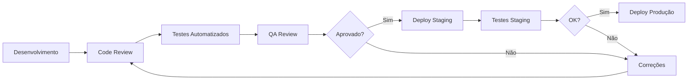

# Processo de QA

## Propósito
Definir o processo de Quality Assurance.

## Fluxo

## Responsabilidades

| Perfil | Responsabilidade |
|---|---|
| **Desenvolvedor** | Testes unitários, code style |
| **Tech Lead** | Code review, testes integração |
| **QA** | Testes E2E, testes manuais, smoke tests |
| **Product Owner** | Aceitação, testes de usabilidade |
