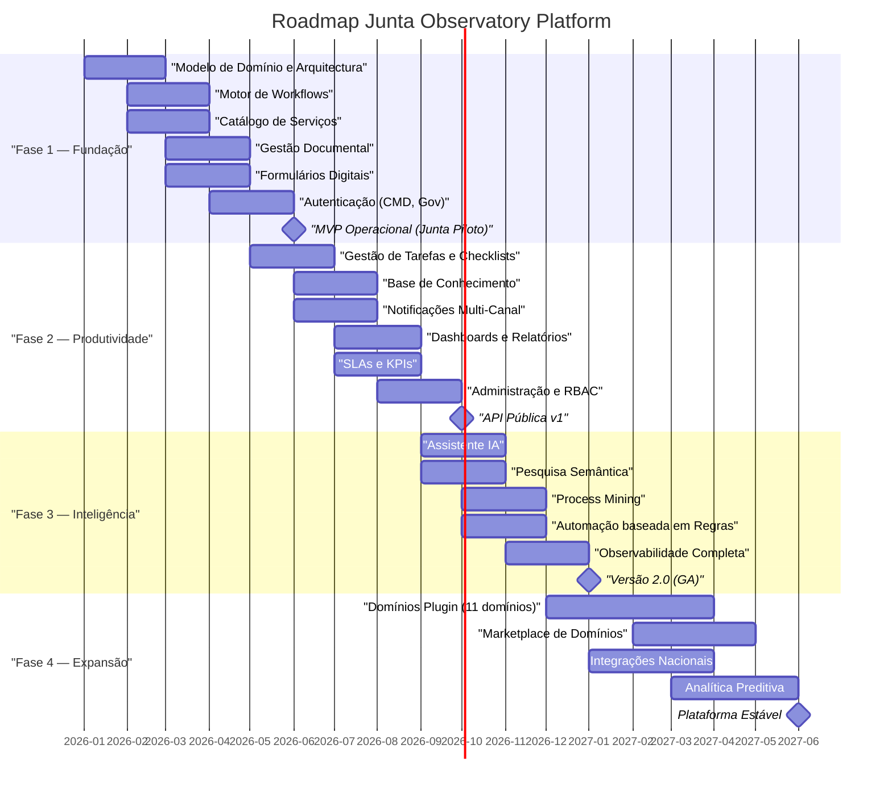

# Roadmap

## Propósito

Definir o roadmap evolutivo da Junta Observatory Platform, organizado em fases com marcos, entregáveis e critérios de transição entre fases.

## Responsabilidades

- Estabelecer a sequência e prioridade das entregas
- Comunicar o plano de evolução da plataforma a todos os stakeholders
- Servir como instrumento de planeamento e gestão de expectativas

## Descrição Detalhada

### Fase 1 — Fundação (Meses 1–6)

**Objectivo:** Lançar MVP operacional com os domínios core a funcionar numa Junta piloto.

**Entregáveis:**
- Arquitectura base e infraestrutura multi-inquilino
- Motor de workflows com versionamento
- Catálogo de serviços configurável
- Gestão documental com templates
- Formulários dinâmicos
- Integração com Chave Móvel Digital e Autenticação.gov
- Domínios core: Atendimento, Atestados, Licenciamento, Processos, Documentos

**Marco:** MVP Operacional (Junho 2026)

### Fase 2 — Produtividade (Meses 5–10)

**Objectivo:** Dotar a plataforma das funcionalidades de produtividade e gestão.

**Entregáveis:**
- Gestão de tarefas, subtarefas e checklists
- Base de conhecimento
- Notificações (email, SMS, push)
- Dashboards e relatórios operacionais
- Gestão de SLAs e KPIs
- Painel de administração com RBAC
- API pública versão 1

**Marco:** API Pública v1 (Outubro 2026)

### Fase 3 — Inteligência (Meses 9–14)

**Objectivo:** Introduzir capacidades de IA e observabilidade avançada.

**Entregáveis:**
- Assistente virtual (chat e pesquisa)
- Pesquisa semântica com RAG
- Process mining e detecção de gargalos
- Motor de automação baseado em regras e eventos
- Observabilidade completa (tracing, métricas, alertas)

**Marco:** Versão 2.0 GA (Janeiro 2027)

### Fase 4 — Expansão (Meses 12–18)

**Objectivo:** Expandir a plataforma com domínios plugin e integrações nacionais.

**Entregáveis:**
- 11 domínios plugin (Espaços, Actividades, Social, Obras, Ambiente, etc.)
- Marketplace de domínios para terceiros
- Integrações com sistemas nacionais (RNID, RNPC, SIG, contabilidade)
- Analítica preditiva baseada em ML

**Marco:** Plataforma Estável (Junho 2027)

## Requisitos

- Cada fase deve ser validada com o comité de produto antes de iniciar
- Os critérios de saída de cada fase devem ser cumpridos para avançar para a fase seguinte
- O roadmap deve ser revisto trimestralmente

## Regras de Negócio

- Funcionalidades previstas para fases posteriores não devem ser implementadas antecipadamente sem validação
- Atrasos superiores a 30 dias em marcos críticos devem ser comunicados a todos os stakeholders

## Critérios de Aceitação

- O roadmap está aprovado pelos stakeholders identificados
- Cada fase tem critérios de saída objectivos e mensuráveis
- O roadmap é revisto e actualizado trimestralmente

## Melhorias Futuras

- Roadmap dinâmico no próprio sistema com simulação de cenários
- Feedback loop de prioridades baseado em dados de utilização

## Documentos Relacionados

- [Objectivos](objetivos.md)
- [Âmbito](ambito.md)
- [15 — Projecto](../15-projeto/index.md)
