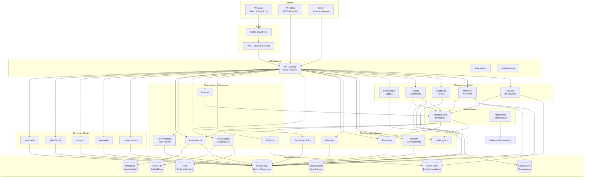

# Diagrama de Contentores (C4 Nível 2)

## Propósito

Mostrar a arquitectura de alto nível da Junta Observatory Platform, decompondo o sistema nos seus principais contentores (microserviços, bases de dados, message broker, etc.) e as relações entre eles.

## Responsabilidades

- Identificar todos os microserviços e sistemas de armazenamento
- Mostrar os protocolos de comunicação entre contentores
- Estabelecer a separação entre frontend, backend, dados e infraestrutura

## Descrição Detalhada

### Legenda de Contentores

| Contentor | Descrição | Tecnologia |
|---|---|---|
| **Web App** | Interface de utilizador SPA | React 19 + TypeScript |
| **API Gateway** | Ponto único de entrada, autenticação, rate limiting | Kong / Traefik |
| **Microserviços Core** | Serviços fundamentais da plataforma | Java 21+ / Spring Boot |
| **Microserviços Suporte** | Serviços de suporte operacional | Java 21+ / Spring Boot |
| **Microserviços Plataforma** | Serviços transversais | Java 21+ / Spring Boot |
| **Domínios Plugin** | Serviços de domínio de negócio opcionais | Java 21+ / Spring Boot |
| **PostgreSQL** | Dados relacionais e de referência | PostgreSQL 16+ |
| **Event Store** | Armazenamento de eventos imutáveis | EventStoreDB / PostgreSQL |
| **MongoDB** | Read models e projecções | MongoDB 7+ |
| **Elasticsearch** | Índices de pesquisa | Elasticsearch 8+ |
| **Redis** | Cache, sessões, rate limiting | Redis 7+ |
| **Object Store** | Armazenamento de documentos | MinIO / S3 |
| **Vector DB** | Embeddings para pesquisa semântica | Qdrant |
| **Apache Kafka** | Barramento de eventos assíncronos | Kafka 3+ |

### Protocolos de Comunicação

| Comunicação | Protocolo | Formato |
|---|---|---|
| Browser → API Gateway | HTTPS | — |
| API Client → API Gateway | HTTPS REST | JSON (JSON:API) |
| API Gateway → Microserviços | HTTP/gRPC | JSON / Protobuf |
| Microserviço → Microserviço | gRPC (sync) | Protobuf |
| Microserviço → Kafka | Kafka Protocol | Avro / JSON |
| Kafka → Microserviço | Kafka Protocol | Avro / JSON |
| Microserviço → Base de Dados | TCP | SQL / Wire Protocol |
| Microserviço → Object Store | S3 API | Binary |

## Regras de Negócio

- Cada microserviço tem a sua própria base de dados (database-per-service)
- A comunicação síncrona entre microserviços é evitada sempre que possível
- O API Gateway é o único ponto de entrada pública
- A descoberta de serviços é feita via Kubernetes DNS / Service Mesh

## Critérios de Aceitação

- Todos os contentores identificados estão mapeados a um ou mais Bounded Contexts
- O diagrama reflecte a separação de responsabilidades entre serviços
- As bases de dados estão atribuídas correctamente a cada serviço

## Documentos Relacionados

- [Diagrama de Contexto](diagrama-de-contexto.md)
- [Diagrama de Componentes](diagrama-de-componentes.md)
- [Bounded Contexts](bounded-contexts.md)
- [Microserviços](microservicos.md)
- [Comunicação entre Serviços](comunicacao-entre-servicos.md)
