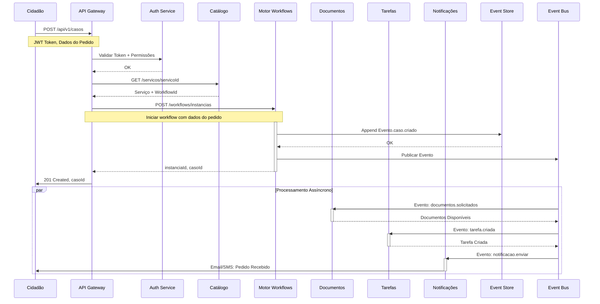
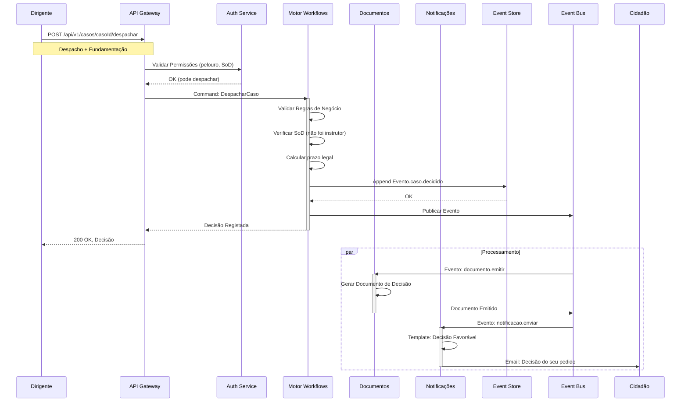
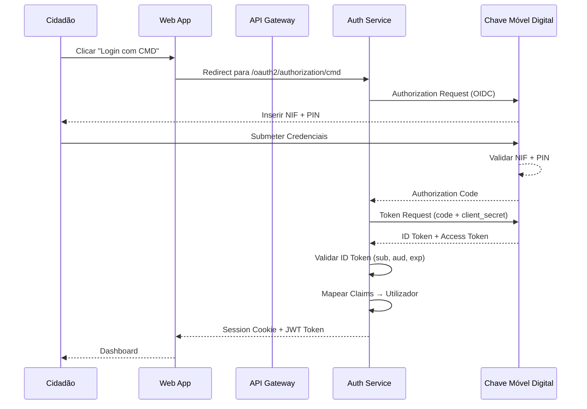
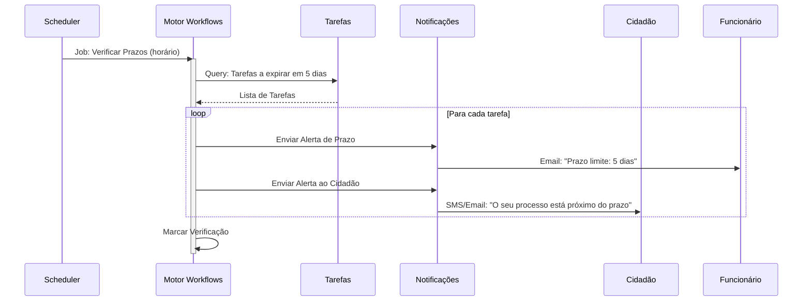
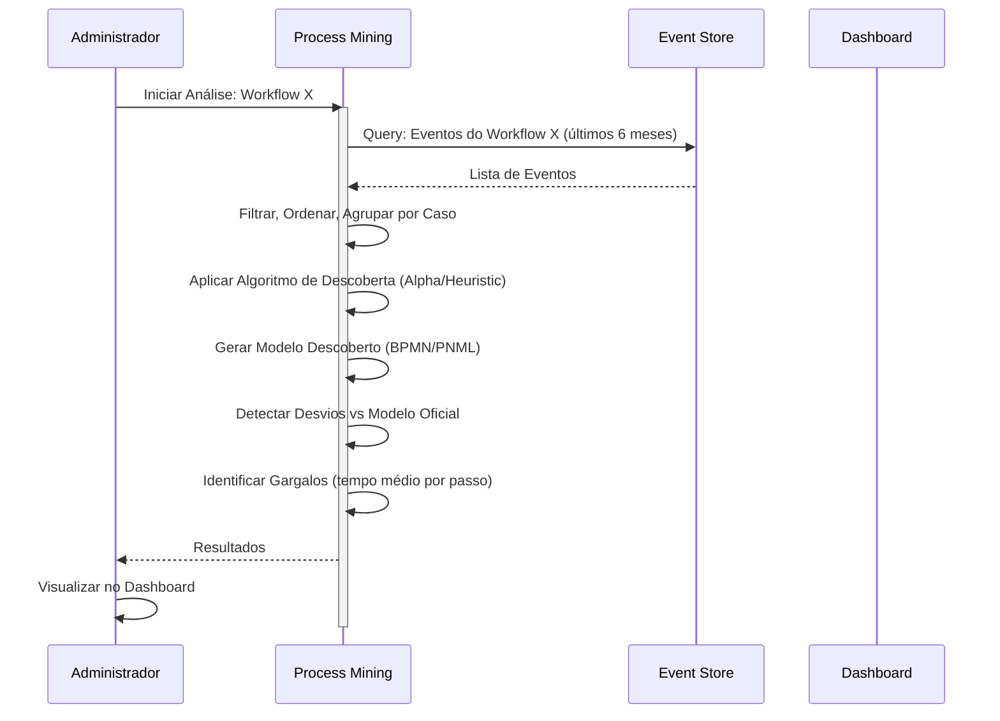

# Diagramas de Sequência

## Propósito

Documentar os principais fluxos de interacção entre componentes da Junta Observatory Platform, mostrando a sequência de mensagens trocadas entre actores, serviços e sistemas externos.

## Responsabilidades

- Ilustrar os fluxos de interacção críticos do sistema
- Validar o desenho arquitectural antes da implementação
- Servir como especificação para a equipa de desenvolvimento

## Descrição Detalhada

### Fluxo: Submissão de Pedido (Cidadão → Plataforma)

### Fluxo: Despacho de Processo (Dirigente → Decisão)

### Fluxo: Autenticação com Chave Móvel Digital

### Fluxo: Notificação de Prazo Prestes a Expirar

### Fluxo: Process Mining — Descoberta de Processo

## Regras de Negócio

- Os diagramas de sequência devem ser actualizados sempre que o fluxo implementado mudar
- Todos os fluxos assíncronos devem incluir tratamento de falhas (timeout, retry, dead letter)
- As interacções com sistemas externos devem incluir circuit breaker

## Critérios de Aceitação

- Os fluxos documentados correspondem exactamente à implementação
- Todos os cenários de erro estão representados (timeout, falha, rejeição)
- Os diagramas são gerados a partir de código ou mantidos manualmente com revisão trimestral

## Documentos Relacionados

- [Diagrama de Contexto](diagrama-de-contexto.md)
- [Diagrama de Contentores](diagrama-de-contentores.md)
- [Comunicação entre Serviços](comunicacao-entre-servicos.md)
- [04 — Plataforma / Workflow](../04-servicos-plataforma/plataforma-workflow.md)
