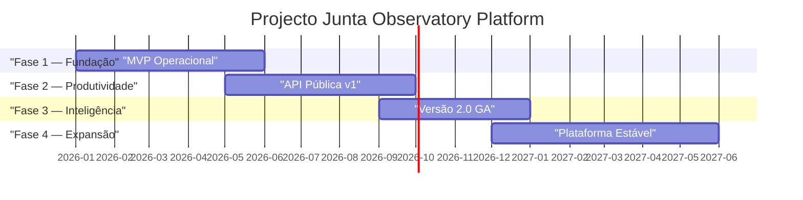

# 15 — Projecto

## Propósito

Esta secção documenta o plano de projecto da Junta Observatory Platform, incluindo as fases, entregáveis, marcos, riscos, equipa e cronograma.

## Responsabilidades

- Definir o plano de execução do projecto
- Estabelecer marcos e entregáveis
- Identificar e gerir riscos
- Acompanhar o progresso e reporting

## Documentos

| Documento | Descrição |
|---|---|
| [Fases](fases.md) | Fases do projecto |
| [Entregáveis](entregaveis.md) | Lista de entregáveis por fase |
| [Marcos](marcos.md) | Marcos do projecto |
| [Riscos](riscos.md) | Matriz de riscos |
| [Equipa](equipe.md) | Estrutura da equipa |
| [Cronograma](cronograma.md) | Cronograma detalhado |

## Fases

## Documentos Relacionados

- [00 — Roadmap](../00-visao-estrategica/roteiro.md)
- [00 — Objectivos](../00-visao-estrategica/objetivos.md)
- [Toda a documentação serve como referência para o planeamento]
